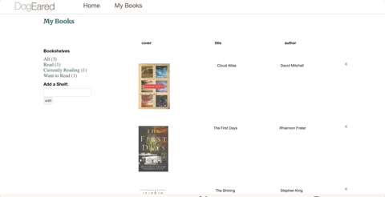

# DogEared
DogEared is a clone of Goodreads, social cataloging website that allows users to track their readings with organized shelving. Users are able to find, shelf, comment, and rate the books they dog-ear and love.

## [Live Site](https://dogeared-app.herokuapp.com)


## Technologies
* Ruby on Rails — back-end
* PostgreSQL — database
* React — front-end 
* JavaScript — front-end
* Redux — state management
* AJAX — asynchronous front-end to back-end communication 
* Heroku — domain hosting

## Key Features
* Manually implemented User Authorization

```Ruby
 def self.find_by_credentials(email, password)
        user = User.find_by(email: email)
        return nil unless user && user.is_password?(password)
        user
    end

    def is_password?(password)
        bcrypt = BCrypt::Password.new(self.password_digest)
        bcrypt.is_password?(password)
    end

    def self.generate_session_token
        SecureRandom::urlsafe_base64
    end

    def password=(password)
        @password = password
        self.password_digest = BCrypt::Password.create(password)
    end

    def ensure_session_token
        self.session_token ||= User.generate_session_token
    end

    def reset_session_token!
        self.update!(session_token: User.generate_session_token)
        self.session_token
    end
```

* Smooth error handling experience for users with customized messages


* Ability to add customized bookshelves and put books on those new shelves



* Placing books on specific shelves and removing them
* Writing reviews on books and rating them

## Challenges

* One of my challenges was to ensure same book could only be put on one single default shelf without duplicates but when dealing with customized new shelves, the book needed to be able to stay on the default shelf but also be put on the customized shelf as well. I utilized shelvings controller, create and destroy functions to put restrictions on each book_id contained on each shelf to determine whether the book needed to be destoryed from previous shelf after being put on a different shelf

* Here is a snipet of my shelvings controller functions:

```Ruby
 def create
      shelf = Shelf.find(params[:shelving][:shelf_id])
      if shelf && ['Read', 'Currently Reading' , 'Want to Read'].include?(shelf.name)
        read = Shelf.find_by(name: 'Read', user_id: current_user)
        curr = Shelf.find_by(name: 'Currently Reading', user_id: current_user)
        want = Shelf.find_by(name: 'Want to Read', user_id: current_user)
        readShelf = Shelving.find_by(shelf_id: read.id, book_id: params[:shelving][:book_id])
        currShelf = Shelving.find_by(shelf_id: curr.id, book_id:  params[:shelving][:book_id])
        wantShelf = Shelving.find_by(shelf_id: want.id, book_id:  params[:shelving][:book_id])
        Shelving.destroy(readShelf.id) if readShelf
        Shelving.destroy(currShelf.id) if currShelf
        Shelving.destroy(wantShelf.id) if wantShelf
      end
      @shelving = Shelving.new(shelving_params)
        if @shelving.save
          cody = Shelving.create(shelf_id: params[:shelving][:all_id], book_id: params[:shelving][:book_id])
          @shelf = @shelving.shelf
          render '/api/shelves/show'
        else
          render json: @shelving.errors.full_messages, status: 422
        end
    end
```


